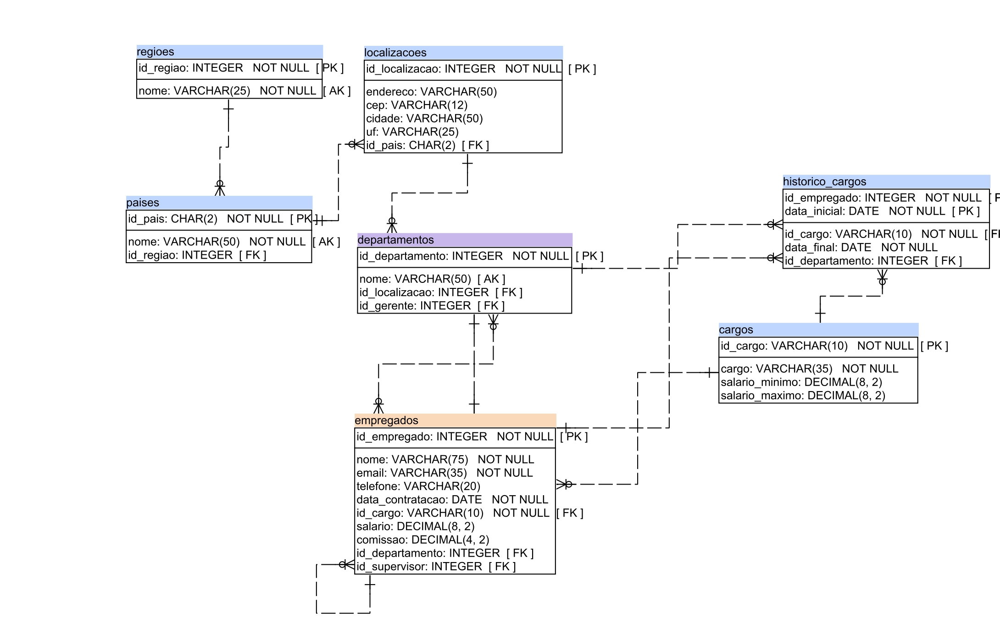

# Implementação do modelo lógico do projeto de Recursos Humanos

O projeto acima foi realizado com o intuito de realizar a implementação do projeto de recursos humanos em modelo lógico e físico em banco de dados

 

Neste diretório se encontra a implementação do modelo físico do projeto RH feito em duas SQLs:

<ul>
  <li>PostgreSQL: cc1n_202203331_postgres_hr.sql</li>
  <li>MariaDB: cc1n_202203331_mariadb_hr.sql</li>
</ul>

Modelo lógico:

<ul>
  <li>hr.pdf</li>
</ul>

E uma breve descrição sobre cada campo do modelo físico e suas tabelas:

<ul>
  <li>hr.html</li>
</ul>
