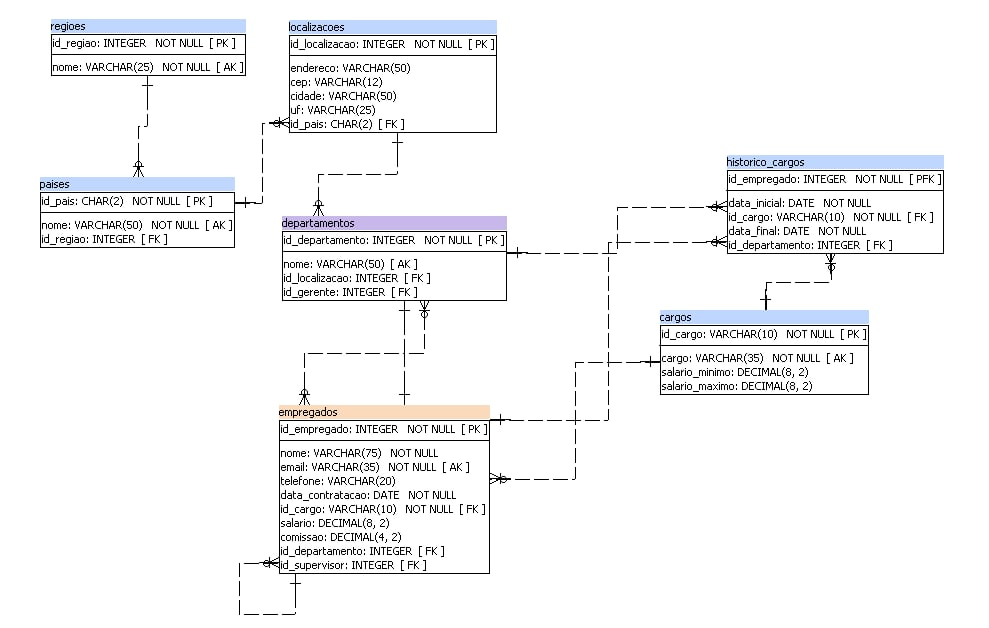

# Banco de dados de Recursos Humanos

 Este repositório possue scripts sql que vão popular um banco de dados com uma base da dados de Recursos humanos.

O projeto foi realizado com o intuito de realizar a implementação do projeto de recursos humanos em modelo lógico e físico em banco de dados

 

Neste diretório se encontra a implementação do modelo físico do projeto RH feito em duas SQLs:

<ul>
  <li>PostgreSQL: <a href="cc1n_202203331_postgresql_hr.sql">cc1n_202203331_postgresql_hr.sql</a></li>
  <li>MariaDB: <a href="cc1n_202203331_mariadb_hr.sql">cc1n_202203331_mariadb_hr.sql</a></li>
</ul>

Modelo lógico:

<ul>
  <li><a href="hr.pdf">hr.pdf</a></li>
</ul>

E uma breve descrição sobre cada campo do modelo físico e suas tabelas:

<ul>
  <li><a href="hr.html">hr.html</a></li>
</ul>
